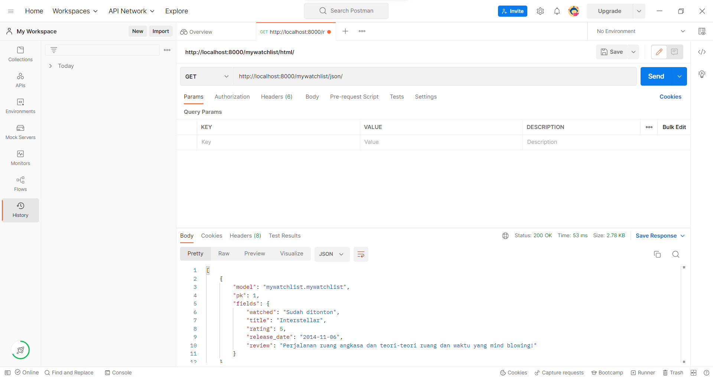

# Tugas 3: Pengimplementasian Data Delivery Menggunakan Django

Nama: Muhammad Hafizha Dhiyaulhaq

NPM : 2106750723

Kelas : D

Kode Asdos: FAR

Link : 
[HTML](https://assignment-pbp2.herokuapp.com/mywatchlist/html/),
[XML](https://assignment-pbp2.herokuapp.com/mywatchlist/xml/),
[JSON](https://assignment-pbp2.herokuapp.com/mywatchlist/json/),
[Bonus](https://assignment-pbp2.herokuapp.com/mywatchlist/watched/)

## 1. Perbedaan JSON, XML, dan HTML
### a. JSON
JSON (*JavaScript Object Notation*) merupakan sebuah format untuk menyimpan dan mengirimkan data dari server menuju *web page*. Data yang ditulis pada JSON berformat `"data":"value"`. Syntax pada JSON berasal dari JavaScript object notation syntax, namun format JSON hanya berupa text saja, sehingga code untuk membaca dan men-generate data dalam JSON, dapat ditulis pada bahasa pemrograman apa saja. Data yang ditampilkan dalam bentuk JSON akan lebih mudah dibaca dan diterjemahkan dibanding dengan XML.

### b. XML
XML (*eXtensible Markup Language*) merupakan markup language seperti HTML yang didesain untuk menyimpan dan mengirim data. Pada dasarnya XML tidak melakukan apa-apa. XML hanya berupa data yang berada dalam tags. Data yang ditulis pada XML berformat `<tag>data</tag>`. XML menyajikan data type yang lebih banyak seperti angka, teks, gambar, grafik, dll. Meskipun sama-sama merupakan markup language, XML memiliki perbedaan dengan HTML. XML berfokus pada penyajian data, sedangkan HTML berfokus untuk mendisplay data. Selain itu, tags yang digunakan pada XML tidak perlu didefinisikan terlebih dahulu seperti pada HTML.

### c. HTML
HTML (*Hyper Text Markup Language*) merupakan markup language yang mendiskripsikan struktur dari halaman web. HTML digunakan untuk mendesain apa yang akan ditampilkan pada browser seperti
text, hyperlink, dan media. Seperti pada XML, HTML juga ditulis dalam bentuk tags yang disebut sebagai elemen. Elemen dari HTML berformat `<tag>content</tag>`. Data yang direquest oleh client, akan dikirimkan dalam bentuk HTML kepada web browser. Web browser inilah yang akan mendisplay sesuai tags pada HTML. 

## 2. Data Delivery
Data delivery merupakan proses mengirimkan data dari server ke dalam platform. Data delivery ini diperlukan untuk menyajikan data dalam bentuk yang mudah diakses kepada client

## 3. Membuat MyWatchList app
1. Untuk membuat aplikasi kita akan menggunakan perintah `python manage.py startapp mywatchlist`. Perintah tersebut secara otomatis membuat sebuah `django-app` baru bernama mywatchlist. Daftarkan terlebih dahulu aplikasi yang kita buat pada `settings.py` pada folder project-django. 

2. Selanjutnya, kita membuat Class `MyWatchList` pada `models.py` yang berisi atribut sesuai pada soal. Setelah itu, kita membuat file `.json` pada folder fixtures yang berisikan data-data yang akan kita tampilkan. Agar data kita tersimpan dalam pada database, kita perlu melakukan migration dengan memanggil perintan `py manage.py makemigrations` dan `py manage.py migrate`. Kemudian load data kita yang ada pada berkas JSON dengan memanggil perintah `py manage.py loaddata initial_mywatchlist_data.json`.

3. Setelah itu, kita membuat 3 fungsi pada `views.py` yang mengembalikan request client dalam 3 bentuk yaitu HTML, XML, dan JSON. 

4. Untuk mengakses aplikasi mywatchlist, kita perlu membuat berkas `urls.py` untuk melakukan routing terhadap fungsi pada `views.py` agar dapat ditampilkan pada web browser. Kita perlu melakukan routing pada `urls.py` yaitu untuk bentuk HTML, XML, dan juga JSON. Jangan lupa mendaftarkan aplikasi kita pada `urls.py` pada folder project-django.

5. Supaya dapat ditampilkan dalam bentuk HTML, kita perlu membuat berkas html pada folder templates yang nantinya akan menampilkan data kita pada browser.

6. Untuk melakukan deployment pada heroku, kita perlu mengubah konfigurasi pada `Procfile` dengan menambahkan perintah load data baru kita agar nantinya data pada mywatchlist bisa ditampilkan pada herokuapp.

## 4. Akses URL melalui Postman
1. `http://localhost:8000/mywatchlist/html`

2. `http://localhost:8000/mywatchlist/xml`

3. `http://localhost:8000/mywatchlist/xml`

## 5. Testing
Testing dilakukan untuk mengetahui apakah aplikasi django yang kita buat berjalan dengan baik atau tidak. Pada tugas 3 ini, saya membuat testing terhadap fungsi pada views dimana test ini akan mengembalikan respon HTTP terhadap request dari client. Bila respon tersebut berupa `HTTP 200 OK`, maka implementasi yang kita lakukan berhasil. 

## References:
1. https://www.w3schools.com/whatis/whatis_json.asp
2. https://www.w3schools.com/xml/xml_whatis.asp
3. https://www.guru99.com/json-vs-xml-difference.html
4. https://www.geeksforgeeks.org/difference-between-json-and-xml/
5. https://www.w3schools.com/js/js_json_xml.asp
6. https://www.w3schools.com/html/html_intro.asp
7. https://docs.djangoproject.com/en/4.1/intro/tutorial05/